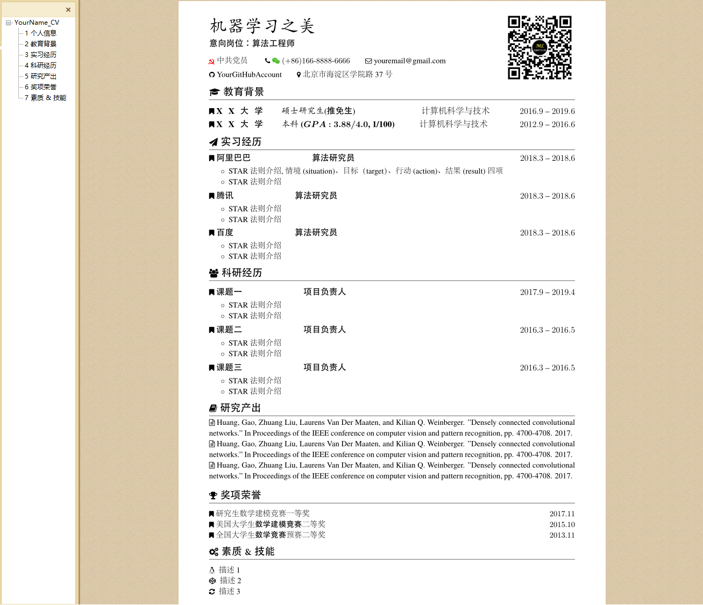

# Resume Template of LaTeX
### 一份在实践中久经考验的LaTeX制作的简历模板

### 1. 下载或者clone该仓库
`git clone git@github.com:wanzhenchn/Resume_Template_LaTeX.git`

### 2. 安装latex排版软件，推荐使用TeXLive2019或者2020版本，安装教程：
- [Ubuntu系统](https://mp.weixin.qq.com/s?__biz=MzU1OTE2NzQyMQ==&mid=2247483908&idx=1&sn=7c1a7f2ee800bbbff217f17ad48e2070&chksm=fc1a20d6cb6da9c0e82aa0821000bfa38b1822ff47555942c7e80b316af6ea01389b272a82d4&token=351551637&lang=zh_CN#rd)
- [Windows系统](https://www.jianshu.com/p/8f8da0517a31)

### 3. 使用XeLaTeX排版引擎编译
`xelatex resume_template.tex`

如果您觉得有帮助, 请在右上角**star**本项目, 您的“点赞”就是对我最大的支持！ 更多资源请关注**微信公众号**：[BreakIntoAI](https://weixin.sogou.com/weixin?type=1&s_from=input&query=BreakIntoAI&ie=utf8&_sug_=n&_sug_type_=)
